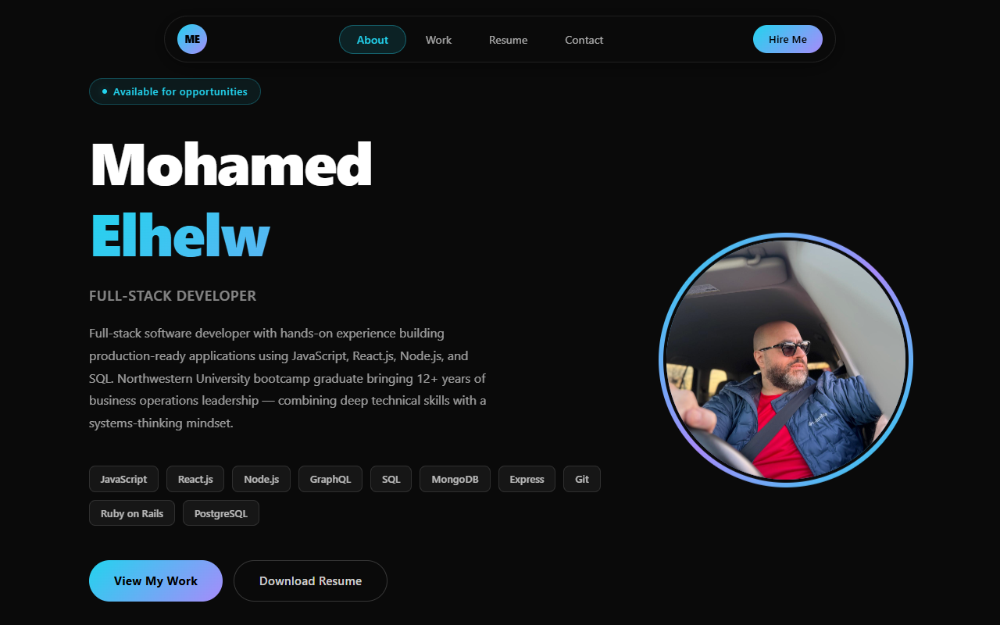
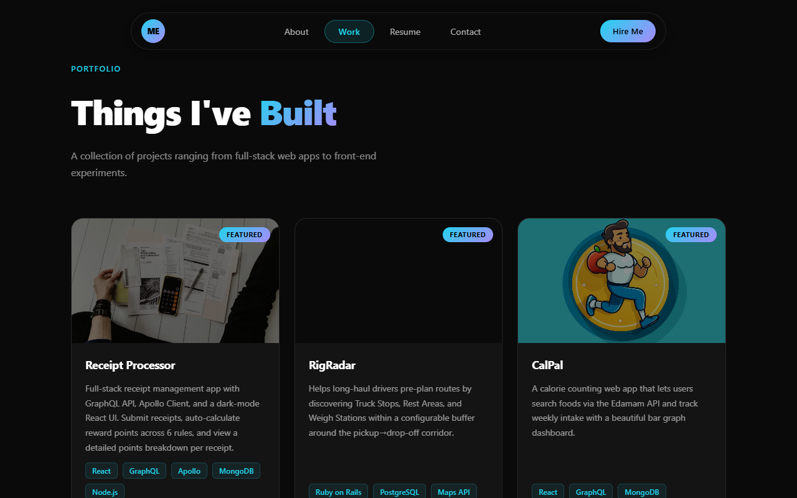

# MyPortfolio-R


## Discription

this is my 20th assignment and it was creating my Portofolio in REACT,

in this 20th assignment  i started my own code 

-my motivation was to practice what i learned in the bootcamp untill Jun 15th 2023

-the problem i experinced is deploying the react to Github, and aliging the footer

## used technologies

- REACT,Tailwind





## github 
https://github.com/melhelow/MyPortfolio-R

## deployed
https://melhelow.github.io/MyPortfolio-R/


## contributing

After cloning, turn on the repo's commit guard once:

```sh
git config core.hooksPath .githooks
```

`.githooks/pre-commit` then rejects any commit whose staged content contains a
phone number or a `tel:` link, PDFs included -- it reads their text layer with
`pdftotext`, because a number hiding inside a compressed PDF stream is
invisible to `grep`. Install `poppler-utils` (Linux) or
`brew install poppler` (macOS) so that check is active; Git for Windows users
get `pdftotext` with the Poppler package.

The same scanner runs in CI (`.github/workflows/no-phone-number.yml`) over the
source tree, the compiled `build/` output, and -- via `gitleaks` and
`.gitleaks.toml` -- the entire git history, so a bypassed hook is still caught
on push. A third, advisory job OCRs committed images, since a screenshot can
show a number that no text scan can see.

To run the checks by hand:

```sh
sh .githooks/scan-phone.sh                 # every tracked file
find build -type f | sh .githooks/scan-phone.sh --stdin
gitleaks detect --config .gitleaks.toml --redact
```

The rules match the *shape* of a phone number rather than any specific value,
so no personal number is ever written into this repository.

## credits

bootcamp,tutor session


## License

please refer to the MIT license in the repo